# Sistema de biblioteca

# 1

A nuestro equipo le tocó hacer un sistema para una biblioteca, el cual tendrá la funcion de registrar libros, mostrar cuantos libros hay, si hay o no ejemplares disponibles, ademas de tambien un sistema de prestamos para saber que ejemplares se prestaron y a quienes, y si la persona tiene un ejemplar a su nombre, no poder prestarles hasta que devuelvan el libro, y finalmente mostrar el catalogo que tiene de libros

Esto se usará tanto para el personal de la biblioteca para los prestamos y control, como para los clientes en el apartedo de buscar libros y conocer si hay existencias disponibles

# 2

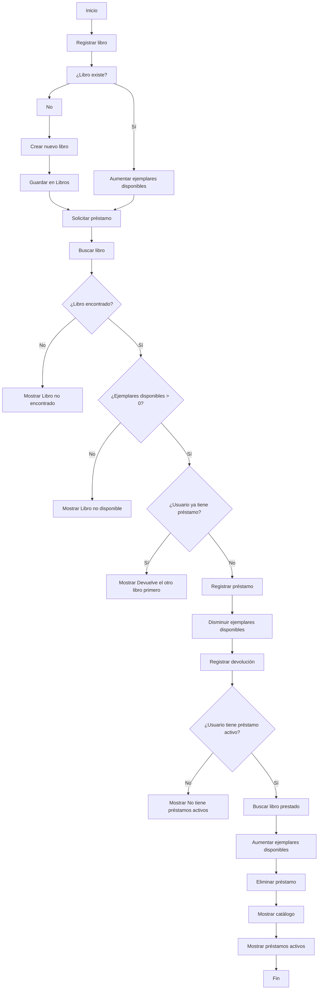

### RegistrarLibro

1. Guardar nombre/título -> Entrada

2. Guardar Stock -> Entrada

3. Guardar autor -> Entrada

4. Guardar Disponibilidad -> Entrada

### BuscarLibro

1. Introducir nombre del libro y autor -> Entradas

2. Buscar libro

3. Buscar autor

4. Mostrar disponibilidad -> Entrada

5. Mostrar stock -> Salida

### RegistrarPrestamo

1. Introducir nombre -> entrada

2. Buscar libro

3. Si está disponible reducir reducir stock en uno

4. Actualizar disponibilidad

5. Si no disponible Mostrar “No hay libros para prestar” -> salida

### RegistrarDevolución

1. Introducir nombre -> entrada

2. Buscar libro

3. Aumentar stock en 2

4. Actualizar stock

5. Mostrar libro devuelto correctamente -> salida

### MostrarCatálogo

1. Mostrar nombre del libro -> salida

2. Mostrar autor -> salida

3. Mostrar stock -> salida

4. Mostrar disponibilidad -> salida

5. Repetir hasta que no haya libros

### MostrarPréstamosActivos

1. Si el stock es menos a la cantidad total de libros mostrar el nombre del libro y cantidad/stock

2. Repetir por cada libro existente en la librería

### GenerarReporte

1. Mostrar libros -> salida

2. Llamar Mostrar catálogo -> salida 

3. Mostrar “préstamos actuales: “ -> salida

4. Llamar préstamos activos -> salida

# 3 Pseudocódigo

Inicio

	Clase Libro

		Atributos:
		título
		autor
		ejemplaresDisponibles
	
		Método constructor(tit, aut, eD)

			título = tit
			autor = aut
			ejemplaresDisponibles = eD
		Fin Método
	Fin Clase
	
	Clase Catálogo
		Atributo
			Libros[] -> Diccionario
			Préstamos[] -> Diccionario
		Método registrarLibro(titulo, autor, eD)
			Si titulo No existe en Libros Entonces
				Libros[titulo] = nuevo Libro(titulo, autor, eD)
					Mostrar(“Libro registrado correctamente”)
			Si no
				Libros[titulo].ejemplaresDisponibles += eD
			Fin Si
		Fin Método
		
	Método buscarLibro(titulo)
			Si titulo existe en Libros
				Retornar Libros[titulo]
			Si no
				Retornar Null
			Fin Si
		Fin Método

	Método mostrarDisponibilidad(titulo)
			libro = buscarLibro(titulo)
			Si libro = Null Entonces
				Mostrar(“Libro no encontrado”)
					Retornar falso
			Fin Si
			Si libro.ejemplaresDisponibles > 0 Entonces
				Retornar verdadero
			Si no
				Retornar falso
			Fin Si
		Fin Método

	Método registrarPrestamos(usuario, titulo)
			disponibilidad = Mostrar (mostrarDisponibilidad(titulo))
			libro = buscarLibro(titulo)
			Si disponibilidad == verdadero Entonces
				Si usuario Existe en Préstamos Entonces
					Mostrar(“Devuelve el otro libro primero”)
				Si no 
					Prestamos[usuario] = nuevo Préstamo (usuario,titulo)
					libro.ejemplaresDisponibles --
				Fin Si
			Si no Entonces
				Mostrar(“Libro no disponible”)
			Fin Si
		Fin Método

	Método registrarDevolución(usuario)
			Si usuario Existe en Préstamos Entonces
				libro = buscarLibro(titulo)
				libro.ejemplaresDisponibles ++
				Eliminar usuario de Préstamos
			Sí no
				Mostrar(“Este usuario no tiene préstamos activos”)
			Fin Si
		Fin Método

	Método mostrarCatálogo()
		Por cada libro en Libros[] hacer
			Mostrar(libro.titulo + “,”)
			Mostrar(libro.autor + “,”)
			disp = mostrarDisponibilidad(libro.titulo)
			Si disp = verdadero
				Mostrar (“Disponible”)
			Si no
				Mostrar (“No disponible”)
			Fin Si
		Fin Por
	Fin Método
		
	Método mostrarPrestamosActivos()
		Por cada usuario en Préstamos[] hacer
			Mostrar (Usuario.usuario + “, libro prestado:”)
			Mostrar (usuario.titulo)
		Fin Por
	Fin Método

	Método generarRegistro()
		Mostrar (“Libros existentes:”)
		Mostrar (mostrarCatálogo)
		Mostrar (“Préstamos activos :”) 
		Mostrar (mostrarPrestamosActivos)
			Fin Método
		Fin Clase
	Fin
Diagramas de Mermaid

# 4
# Diagrama general del sistema

Este primer diagrama muestra la relación entre las clases principales y cómo se conectan los métodos.
Después incluyo un diagrama independiente para cada clase y diagramas detallados para cada método.

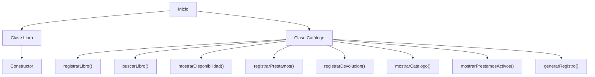

---

# Clase Libro

Este diagrama representa únicamente la estructura de la clase `Libro`.

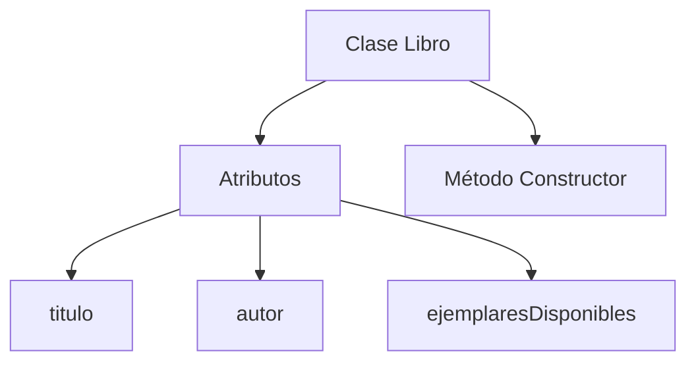

---

# Método constructor(tit, aut, eD)

Este método inicializa un objeto Libro.

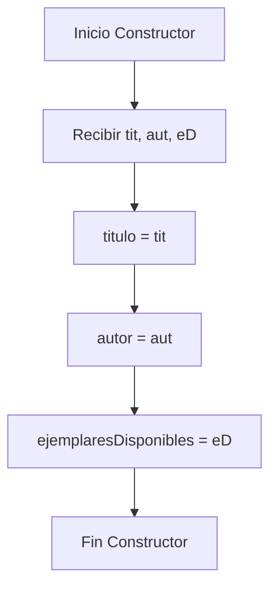

---

# Clase Catálogo

Este diagrama representa la estructura completa de la clase `Catálogo`.

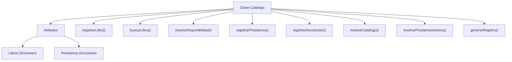

---

# Método registrarLibro(titulo, autor, eD)

Explicación:

* Verifica si el libro ya existe.
* Si no existe, lo crea.
* Si ya existe, aumenta la cantidad de ejemplares.

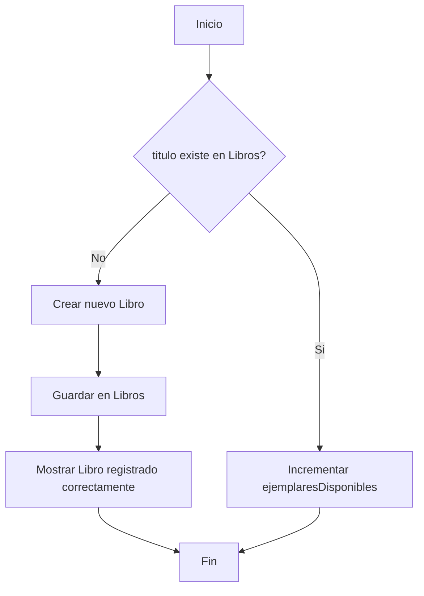

---

# Método buscarLibro(titulo)

Explicación:

* Busca el libro dentro del diccionario.
* Retorna el libro si existe.
* Retorna Null si no existe.

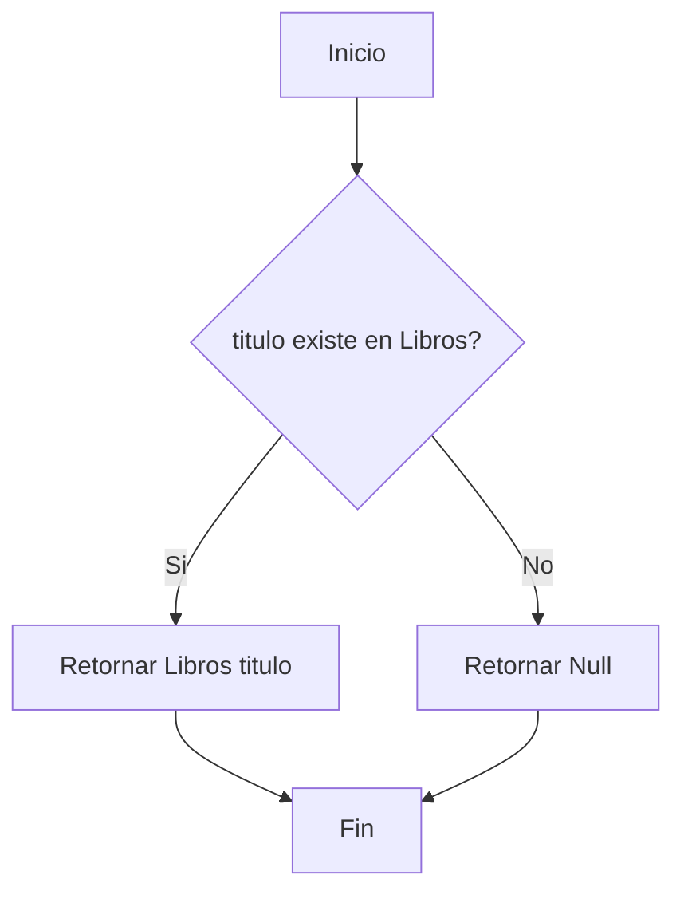

---

# Método mostrarDisponibilidad(titulo)

Explicación:

* Busca el libro.
* Verifica si existe.
* Comprueba si tiene ejemplares disponibles.

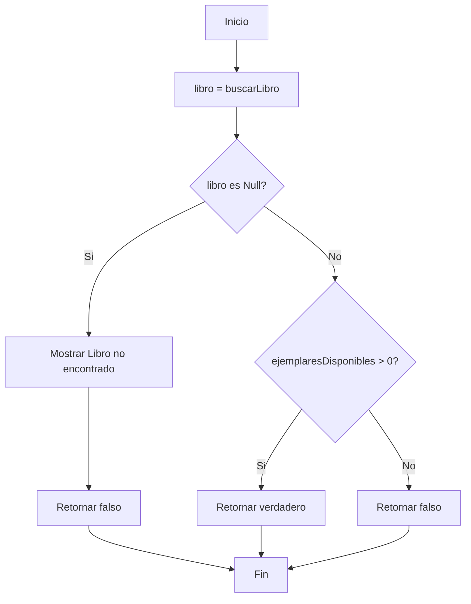

---

# Método registrarPrestamos(usuario, titulo)

Explicación:

* Verifica disponibilidad.
* Comprueba si el usuario ya tiene préstamo.
* Registra el préstamo y reduce existencias.

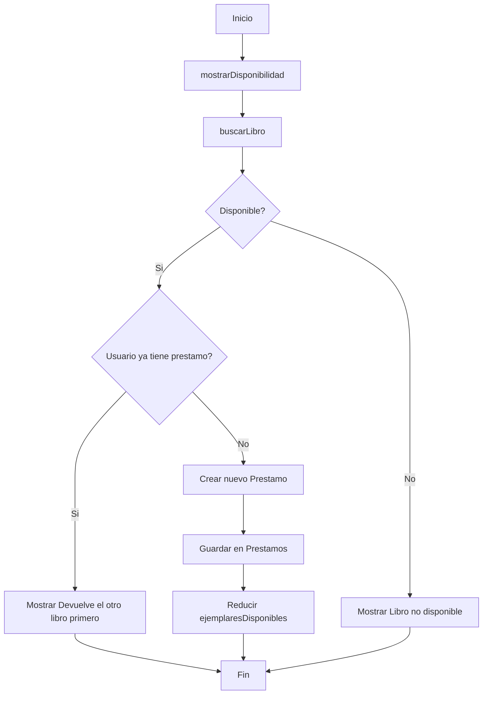

---

# Método registrarDevolucion(usuario)

Explicación:

* Verifica si el usuario tiene un préstamo activo.
* Incrementa disponibilidad.
* Elimina el préstamo.

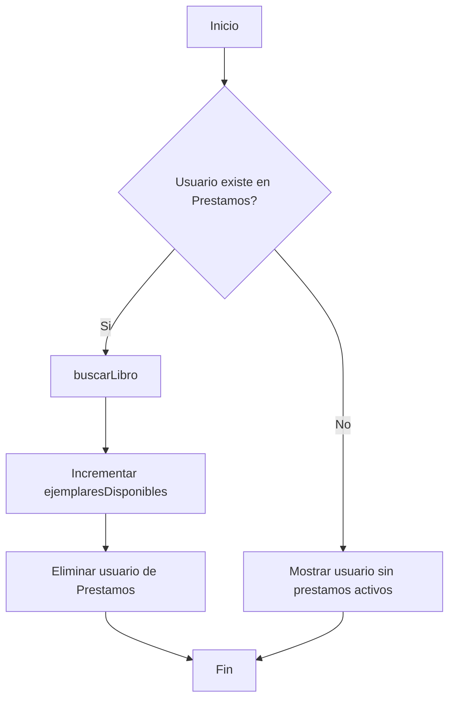

---

# Método mostrarCatalogo()

Explicación:

* Recorre todos los libros.
* Muestra datos y disponibilidad.

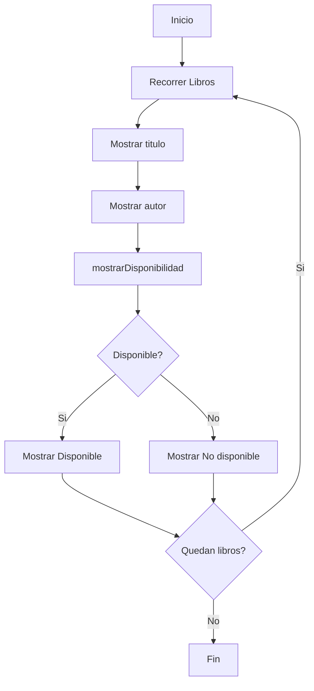

---

# Método mostrarPrestamosActivos()

Explicación:

* Recorre todos los préstamos activos.
* Muestra usuario y libro prestado.

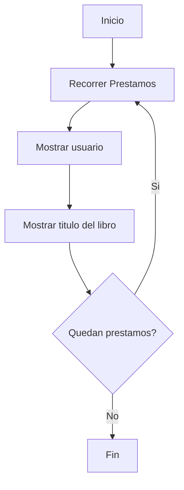

---

# Método generarRegistro()

Explicación:

* Genera un reporte general del sistema.

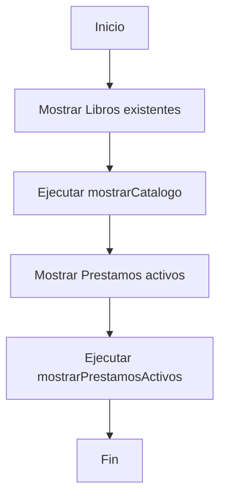

