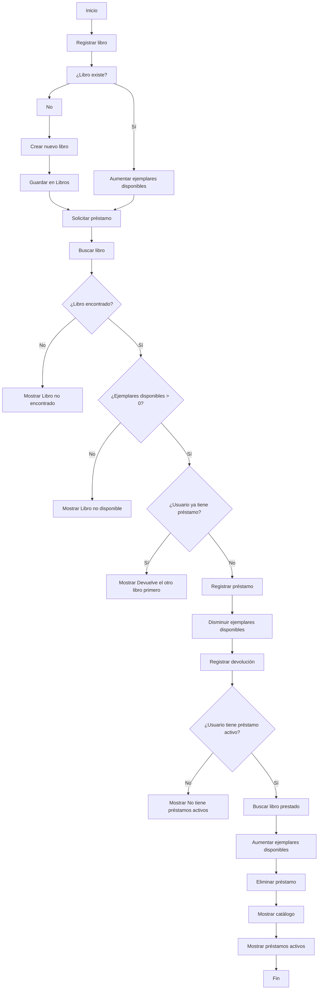

# trabajo-equipo
```
### RegistrarLibro
Guardar nombre/título -> Entrada
Guardar Stock -> Entrada
Guardar autor -> Entrada
Guardar Disponibilidad -> Entrada

### BuscarLibro
Introducir nombre del libro y autor -> Entradas
Buscar libro
Buscar autor
Mostrar disponibilidad -> Entrada
Mostrar stock -> Salida

### RegistrarPrestamo
Introducir nombre -> entrada
Buscar libro
Si está disponible reducir reducir stock en uno
Actualizar disponibilidad
Si no disponible Mostrar “No hay libros para prestar” -> salida

### RegistrarDevolución
Introducir nombre -> entrada
Buscar libro
Aumentar stock en 2
Actualizar stock
Mostrar libro devuelto correctamente -> salida

### MostrarCatálogo
Mostrar nombre del libro -> salida
Mostrar autor -> salida
Mostrar stock -> salida
Mostrar disponibilidad -> salida
Repetir hasta que no haya libros

### MostrarPréstamosActivos
Si el stock es menos a la cantidad total de libros mostrar el nombre del libro y cantidad/stock
Repetir por cada libro existente en la librería

### GenerarReporte
Mostrar libros -> salida
Llamar Mostrar catálogo -> salida 
Mostrar “préstamos actuales: “ -> salida
Llamar préstamos activos -> salida


## Pseudocódigo
Inicio
Clase Libro
		Atributos:
		título
		autor
		ejemplaresDisponibles
		

	Método constructor(tit, aut, eD)
		título = tit
		autor = aut
		ejemplaresDisponibles = eD
		Fin Método
	Fin Clase
	
	Clase Catálogo
		Atributo
			Libros[] -> Diccionario
			Préstamos[] -> Diccionario
		Método registrarLibro(titulo, autor, eD)
			Si titulo No existe en Libros Entonces
				Libros[titulo] = nuevo Libro(titulo, autor, eD)
					Mostrar(“Libro registrado correctamente”)
			Si no
				Libros[titulo].ejemplaresDisponibles += eD
			Fin Si
		Fin Método
		
		Método buscarLibro(titulo)
			Si titulo existe en Libros
				Retornar Libros[titulo]
			Si no
				Retornar Null
			Fin Si
		Fin Método

		Método mostrarDisponibilidad(titulo)
			libro = buscarLibro(titulo)
			Si libro = Null Entonces
				Mostrar(“Libro no encontrado”)
					Retornar falso
			Fin Si
			Si libro.ejemplaresDisponibles > 0 Entonces
				Retornar verdadero
			Si no
				Retornar falso
			Fin Si
		Fin Método

		Método registrarPrestamos(usuario, titulo)
			disponibilidad = Mostrar (mostrarDisponibilidad(titulo))
			libro = buscarLibro(titulo)
			Si disponibilidad == verdadero Entonces
				Si usuario Existe en Préstamos Entonces
					Mostrar(“Devuelve el otro libro primero”)
				Si no 
					Prestamos[usuario] = nuevo Préstamo (usuario,titulo)
					libro.ejemplaresDisponibles --
				Fin Si
			Si no Entonces
				Mostrar(“Libro no disponible”)
			Fin Si
		Fin Método

		Método registrarDevolución(usuario)
			Si usuario Existe en Préstamos Entonces
				libro = buscarLibro(titulo)
				libro.ejemplaresDisponibles ++
				Eliminar usuario de Préstamos
			Sí no
				Mostrar(“Este usuario no tiene préstamos activos”)
			Fin Si
		Fin Método


		Método mostrarCatálogo()
			Por cada libro en Libros[] hacer
				Mostrar(libro.titulo + “,”)
				Mostrar(libro.autor + “,”)
				disp = mostrarDisponibilidad(libro.titulo)
				Si disp = verdadero
					Mostrar (“Disponible”)
				Si no
					Mostrar (“No disponible”)
				Fin Si
			Fin Por
		Fin Método
		
Método mostrarPrestamosActivos()
	Por cada usuario en Préstamos[] hacer
		Mostrar (Usuario.usuario + “, libro prestado:”)
		Mostrar (usuario.titulo)
	Fin Por
Fin Método

Método generarRegistro()
Mostrar (“Libros existentes:”)
Mostrar (mostrarCatálogo)
Mostrar (“Préstamos activos :”) 
Mostrar (mostrarPrestamosActivos)
		Fin Método
	Fin Clase
Fin
Diagramas de Mermaid
```




flowchart TB
    A([Inicio]) --> B[Definir Clase Libro]
    
    %% Clase Libro
    B --> B1[Atributos:<br/>titulo<br/>autor<br/>ejemplaresDisponibles]
    B1 --> B2[Constructor(tit, aut, eD)]
    B2 --> B3[titulo = tit]
    B3 --> B4[autor = aut]
    B4 --> B5[ejemplaresDisponibles = eD]

    %% Clase Catalogo
    B5 --> C[Definir Clase Catalogo]

    C --> C1[Atributos:<br/>Libros[] Diccionario<br/>Prestamos[] Diccionario]

    %% registrarLibro
    C1 --> D[Metodo registrarLibro]
    D --> D1{titulo existe en Libros?}

    D1 -- No --> D2[Crear nuevo Libro]
    D2 --> D3[Libros[titulo] = nuevo Libro]
    D3 --> D4[Mostrar: Libro registrado correctamente]

    D1 -- Si --> D5[Incrementar ejemplaresDisponibles]

    %% buscarLibro
    D4 --> E[Metodo buscarLibro]
    D5 --> E

    E --> E1{titulo existe en Libros?}

    E1 -- Si --> E2[Retornar Libros[titulo]]
    E1 -- No --> E3[Retornar Null]

    %% mostrarDisponibilidad
    E2 --> F[Metodo mostrarDisponibilidad]
    E3 --> F

    F --> F1[libro = buscarLibro(titulo)]
    F1 --> F2{libro == Null?}

    F2 -- Si --> F3[Mostrar: Libro no encontrado]
    F3 --> F4[Retornar falso]

    F2 -- No --> F5{ejemplaresDisponibles > 0?}

    F5 -- Si --> F6[Retornar verdadero]
    F5 -- No --> F7[Retornar falso]

    %% registrarPrestamos
    F4 --> G[Metodo registrarPrestamos]
    F6 --> G
    F7 --> G

    G --> G1[disponibilidad = mostrarDisponibilidad]
    G1 --> G2[libro = buscarLibro]
    G2 --> G3{disponibilidad == verdadero?}

    G3 -- Si --> G4{usuario existe en Prestamos?}

    G4 -- Si --> G5[Mostrar: Devuelve el otro libro primero]

    G4 -- No --> G6[Crear nuevo Prestamo]
    G6 --> G7[Prestamos[usuario] = Prestamo]
    G7 --> G8[Disminuir ejemplaresDisponibles]

    G3 -- No --> G9[Mostrar: Libro no disponible]

    %% registrarDevolucion
    G5 --> H[Metodo registrarDevolucion]
    G8 --> H
    G9 --> H

    H --> H1{usuario existe en Prestamos?}

    H1 -- Si --> H2[libro = buscarLibro]
    H2 --> H3[Incrementar ejemplaresDisponibles]
    H3 --> H4[Eliminar usuario de Prestamos]

    H1 -- No --> H5[Mostrar: Usuario no tiene prestamos activos]

    %% mostrarCatalogo
    H4 --> I[Metodo mostrarCatalogo]
    H5 --> I

    I --> I1[Recorrer Libros[]]

    I1 --> I2[Mostrar titulo]
    I2 --> I3[Mostrar autor]
    I3 --> I4[disp = mostrarDisponibilidad]

    I4 --> I5{disp == verdadero?}

    I5 -- Si --> I6[Mostrar: Disponible]
    I5 -- No --> I7[Mostrar: No disponible]

    %% mostrarPrestamosActivos
    I6 --> J[Metodo mostrarPrestamosActivos]
    I7 --> J

    J --> J1[Recorrer Prestamos[]]
    J1 --> J2[Mostrar usuario]
    J2 --> J3[Mostrar titulo prestado]

    %% generarRegistro
    J3 --> K[Metodo generarRegistro]

    K --> K1[Mostrar: Libros existentes]
    K1 --> K2[Mostrar mostrarCatalogo]
    K2 --> K3[Mostrar: Prestamos activos]
    K3 --> K4[Mostrar mostrarPrestamosActivos]

    K4 --> L([Fin])


